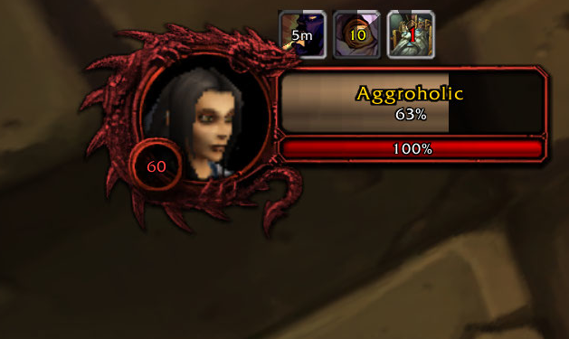
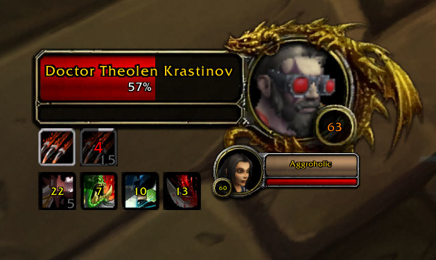
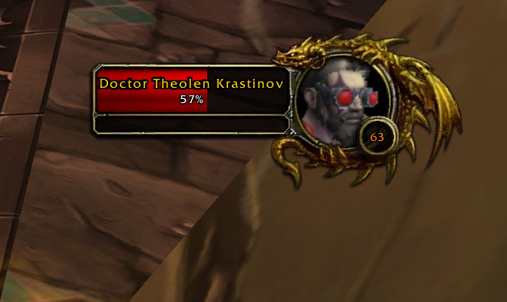
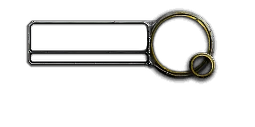
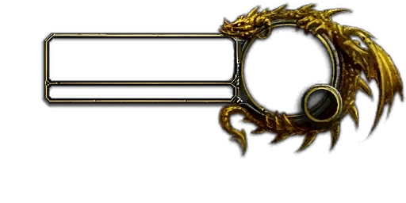
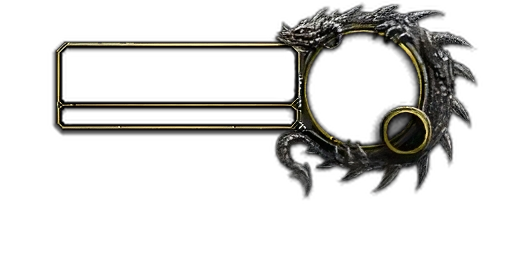

# Unit Frames Improved

**A sleek unit frame replacement for Ascension's Warcraft Reborn** with sharper textures, movable frames, integrated cast bars, and quality-of-life improvements that make tracking combat easier.

---

## Unit Frames

### Player

* Self buffs above health bar
* Red frame indicates aggro
* Red level text indicates in combat

### Target

* Tracks your debuffs only

### Focus

* Track buffs
* Track all debuffs (from any source)
* Cast bar

### Boss

## High-resolution custom textures adapt automatically based on your target's classification

| **Regular** | **Elite** |
|---------|-------|
|  |  |

| **Rare** | **Rare Elite** |
|---------|-------|
|  |  |

---

## Why Use This Addon?

Replace the default Blizzard unit frames with:

* **Crisper, higher-resolution textures** (2x sharper than default)
* **Fully movable frames** - put your player, target, focus, and boss frames wherever you want
* **Integrated cast bars** on target, focus, and boss frames
* **Smart debuff tracking** - target shows your debuffs only, focus shows all debuffs
* **Right-click menus** for quick access to raid icons, difficulty settings, and player interactions
* **Smooth, clean design** that looks great without needing complicated configuration

**No setup required** - just install and play!

---

## Quick Install

1. Download and extract the `UnitFramesImproved` folder
2. Place it in: `World of Warcraft/Interface/AddOns/`
3. Restart WoW or type `/reload` if already in-game
4. **Done!** Your frames are now upgraded

---

## What You Get

### ✨ Enhanced Player Frame

* Health and power bars with percentage or numeric display
* **Self-buff tracker** - shows your 5 most important buffs sorted by time remaining
* **Right-click menu** for dungeon/raid difficulty and raid icons
* Resting indicator and combat status
* Circular portrait

### 🎯 Improved Target Frame

* **Cast bar** right below the portrait - never miss an interrupt
* **Elite and rare borders** - gold dragons for elites, silver for rares (see gallery above!)
* Shows target's buffs and **only your debuffs** (no clutter!)
* **Right-click menu** - whisper, inspect, invite, trade, focus, and raid icons
* Color-coded difficulty level

### 🔍 Focus Frame

* Similar to target frame, but shows **all debuffs** from any source
* **Dedicated cast bar** for tracking interrupts
* Shows all buffs for full awareness
* **Respects "Larger Focus Frame"** setting in Interface Options
* Right-click menu for quick interactions

### 👥 Target of Target

* See what your current target is looking at
* Respects your Interface Options settings for when it appears

### 💀 Boss Frames

* **Four compact boss frames** that stack neatly on the side
* **Cast bars on each boss** - track multiple casts at once
* Click to target bosses instantly
* Elite/rare borders automatically adapt
* Show/hide automatically during encounters

---

## Moving Your Frames

Want the player frame in the bottom corner? Target frame near the center? Easy:

1. Type **`/ufi unlock`** - green overlays appear on your frames
2. **Click and drag** any frame to where you want it
3. Type **`/ufi lock`** - saves your layout

**Pro tip:** Each character saves its own layout, so your tank and healer can have different setups.

### Reset if Needed

* `/ufi reset player` - reset just the player frame
* `/ufi reset target` - reset just the target frame  
* `/ufi reset focus` - reset just the focus frame
* `/ufi reset boss` - reset boss frames
* `/ufi reset` - reset everything to defaults

---

## Right-Click Menus

### On Your Player Frame

* Set **dungeon difficulty** (Normal, Heroic, Mythic)
* Set **raid difficulty** (10/25 Normal, Heroic, Mythic, Ascended)
* Reset instances (with confirmation)
* Place **raid target icons** on yourself

### On Target/Focus Frames

* Whisper, Inspect, Invite, Trade, Follow, Duel
* Compare Achievements
* Place **raid target icons**
* Options grey out when not available (e.g., can't trade with NPCs)

---

## Extra Features

* **Circular portraits** - cleaner look than the default squares
* **High-res textures** - all frame artwork is double the resolution for crisp edges
* **Cast bar interrupt detection** - interruptible casts show green borders and gold icon frames, uninterruptible casts show red borders and purple icon frames
* **Debuff type coloring** - borders show magic (blue), poison (green), curse (purple), disease (brown)
* **Stack counts** - see how many stacks of a buff/debuff
* **OmniCC compatible** - cooldown timers work if you have OmniCC installed
* **No combat taint** - won't break your UI or cause errors

---

## Commands Reference

Type `/ufi help` in-game to see all commands:

* **`/ufi unlock`** - Unlock frames to reposition them
* **`/ufi lock`** - Lock frames and save positions
* **`/ufi reset [frame]`** - Reset positions (player/target/focus/boss/all)
* **`/ufi help`** - Show command help

---

## FAQ

**Q: Will this work with other addons?**  
A: Yes! It's specifically designed to avoid conflicts and works with OmniCC, WeakAuras, and most popular addons.

**Q: Can I configure colors or sizes?**  
A: The addon is designed to work perfectly out of the box without configuration. Each frame saves its scale when you move it.

**Q: What if I'm in combat and want to move frames?**  
A: Frames automatically lock during combat to prevent errors. Wait until you're out of combat, then use `/ufi unlock`.

**Q: Does this disable Blizzard's default frames?**  
A: Yes, completely. This is a full replacement.

**Q: Will my frame positions save if I log out?**  
A: Yes! Positions are saved per character automatically.

---

## Known Issues

* Reset Instances menu shows confirmation but actual reset depends on server implementation
* Some menu text may not be fully localized in non-English clients

---

## Credits

**Design & Development**: Custom implementation for Ascension Warcraft Reborn  
**Textures**: Enhanced from Blizzard's default UI artwork  
**Inspired by**: ElvUI and oUF design principles

---

## License

Provided as-is for Ascension's Warcraft Reborn private server.

---

**Enjoy cleaner, more functional unit frames!** ⚔️
